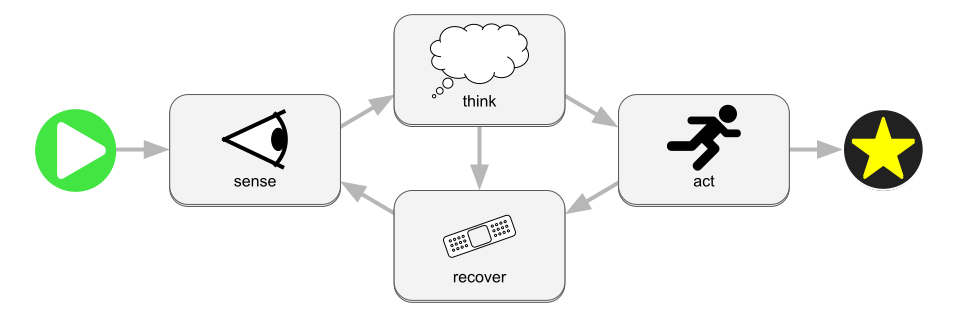

# Reactive Programming for Bevy

This library provides sophisticated [reactive programming](https://en.wikipedia.org/wiki/Reactive_programming) for the [bevy](https://bevyengine.org/) ECS. In addition to supporting one-shot chains of async operations, it can support reusable workflows with parallel branches, synchronization, races, and cycles. These workflows can be hierarchical, so a workflow can be used as a building block by other workflows.

# Why use bevy impulse?

There are several different categories of problems that bevy impulse sets out to solve. If any one of these use-cases is relevant to you, it's worth considering bevy impulse as a solution:

* Coordinating **async activities** (e.g. filesystem i/o, network i/o, or long-running calculations) with regular bevy systems
* Calling **one-shot systems** on an ad hoc basis, where the systems require an input value and produce an output value that you need to use
* Defining a **procedure** to be followed by your application or by an agent or pipeline within your application
* Designing a complex **state machine** that gradually switches between different modes or behaviors while interacting with the world
* Managing many **parallel threads** of activities that need to be synchronized or raced against each other

# Helpful Links

 * [Introduction to workflows](https://docs.google.com/presentation/d/1_vJTyFKOB1T0ylCbp1jG72tn8AXYQOKgTGh9En9si-w/edit?usp=sharing)
 * [Bevy Impulse Docs](https://docs.rs/bevy_impulse/latest/bevy_impulse/)
 * [Bevy Engine](https://bevyengine.org/)
 * [Bevy Cheat Book](https://bevy-cheatbook.github.io/)
 * [Rust Book](https://doc.rust-lang.org/stable/book/)
 * [Install Rust](https://www.rust-lang.org/tools/install)

# Compatibility

Bevy Impulse is supported across several releases of Bevy:

| bevy | bevy_impulse |
|------|--------------|
|0.14  | 0.2          |
|0.13  | 0.1          |
|0.12  | 0.0.x        |

The `main` branch currently targets bevy version 0.12 (bevy impulse 0.0.x)
so that new developments are still compatible for users of bevy 0.12. New features
will be forward-ported as soon as possible. `main` will move forward to newer
versions of bevy when we judge that enough of the ecosystem has finished migrating
forward that there is no longer value in supporting old versions. In the future
we may come up with a more concrete policy for this, and we are open to input on
the matter.
