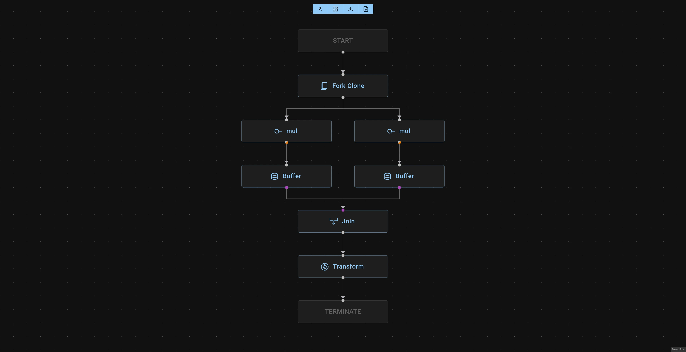

# bevy_impulse_diagram_editor



This contains a SPA React web app to create and edit a `bevy_impulse` diagram and an axum router to serve it.

## Embedding the Diagram Editor into a `bevy_impulse` app

`bevy_impulse_diagram_editor` contains an embedded version of the frontend. An `axum` router is provided
that can be used to serve the embedded frontend.

```bash
cargo add bevy_impulse_diagram_editor axum tokio
```

> [!IMPORTANT]
> `bevy_impulse_diagram_editor` is not released yet, for now, use `cargo add --git https://github.com/open-rmf/bevy_impulse bevy_impulse_diagram_editor`.


```rust
use bevy_impulse_diagram_editor::{new_router, ServerOptions};

fn main() {
  let mut registry = DiagramElementRegistry::new();
  // register node builders, section builders etc.

  let mut app = bevy_app::App::new();
  app.add_plugins(ImpulseAppPlugin::default());
  let router = new_router(&mut app, registry, ServerOptions::default());
  let listener = tokio::net::TcpListener::bind(("localhost", 3000))
      .await
      .unwrap();
  axum::serve(listener, router).await?;
}
```

### Standalone Diagram Editor API server

The embedded frontend can be disabled:

```toml
[dependencies]
bevy_impulse_diagram_editor = { version = "0.0.1", default-features = false, features = ["router"] }
```

This will cause the router to serve only the rest API.

See the [calculator demo](../examples/diagram/calculator) for more examples.

### WebAssembly Local Backend

If the bevy app can be compiled into a WebAssembly blob, the diagram editor can use it in place of an API server.

See [bevy_impulse_diagram_editor_wasm](./wasm/README.md) for more info.

## Local development server

Normally the web stack is not required by using this crate as a dependency, but it is required when developing the frontend.

Requirements:

* nodejs
* pnpm

### Setup

Install pnpm and nodejs:

```bash
curl -fsSL https://get.pnpm.io/install.sh | bash -
pnpm env use --global lts
```

Install the dependencies:

```bash
pnpm install
```

First start the `dev` backend server:

```bash
pnpm dev:backend
```

then in another terminal, start the frontend `dev` server:

```bash
pnpm dev
```

When there are breaking changes in `bevy_impulse`, the typescript definitions need to be regenerated:

```bash
pnpm generate-types
```
