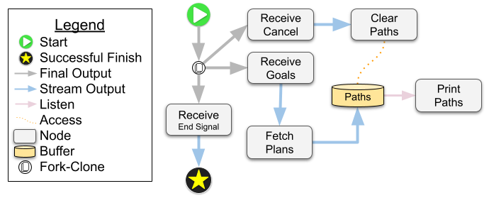

## Building workflows with ROS nodes

The examples in this directory showcase how to incorporate ROS primitives into a workflow. We model a small portion of a navigation workflow that involves receiving goals, fetching paths to connect those goals from a planning service, and then queuing up the paths for execution.

This diagram represents the workflow implemented by [`diagrams/default-nav-system.json`](diagrams/default-nav-system.json):



After following the build instructions in the [root README](../../README.md), run this example with the following steps:

1. Source the workspace with

```bash
source install/setup.bash # run in the root of your colcon workspace
```

2. Then you can go into this `examples/ros2` directory and run the example with

```bash
cargo run --bin nav-executor -- run diagrams/default-nav-system.json # run in this directory
```

3. The `nav-example` workflow will wait until it receives some goals to process. You can send it some randomized goals by **opening a new terminal** in the same directory and running

```bash
source install/setup.bash # run in the root of your colcon workspace
```

```bash
cargo run --bin goal-requester # run in this directory
```

Now the workflow will print out all the plans that it has received from the `fake-plan-generator` and stored in its buffer. If the workflow were connected to a real navigation system, it could pull these plans from the buffer one at a time and execute them.

4. Our workflow also allows the paths to be cleared out of the buffer, i.e. "cancelled". To cancel the current set of goals, run:

```bash
cargo run --bin goal-requester -- --cancel
```

After that you should see a printout of

```
Paths currently waiting to run:
[]
```

which indicates that the buffer has been successfully cleared out.

5. You can view and edit the navigation workflow by running the web-based editor:

```bash
cargo run --bin nav-executor -- serve # run in this directory
```

Open up a web browser (chrome works best) and go to [http://localhost:3000](http://localhost:3000). Use the upload button to load the default nav workflow from [`diagrams/default-nav-system.json`](diagrams/default-nav-system.json). After you've edited it, you can run it immediately using the play button (enter `null` into the input box that pops up). Or you can use the export button to download and save your changes.

6. The diagram editor does not currently have a button for cancelling a workflow. To stop a workflow that is currently running, use

```bash
ros2 topic pub end_workflow std_msgs/Empty
```

The default workflow will listen to the `/end_workflow` topic for any message, and then exit as soon as one is received. After you have triggerd the workflow to end, you should this message in the response:

```
"workflow ended by /end_workflow request"
```

7. To see how to register custom diagram operations and any ROS messages, services, or actions that you need, take a look at [`src/nav_ops_catalog.rs`](src/nav_ops_catalog.rs).
