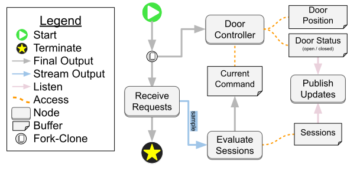
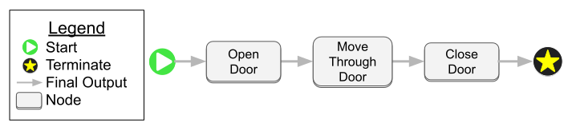
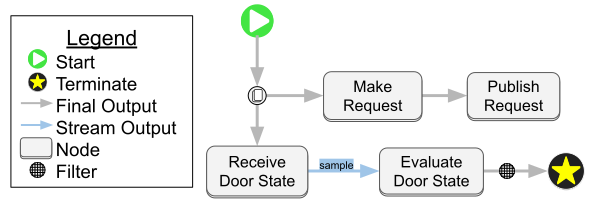

## Building workflows with Zenoh nodes

The examples in this directory showcase how to incorporate Zenoh subscribers and publishers into a workflow. We model interactions between a mobile robot and an automated door.

To run this demo, first run the following command to begin a mock "door manager" for a door named "lobby":

```bash
cargo run -p zenoh-examples --bin door-manager -- --names lobby
```

The `door-manager` application will pretend to be a driver for a smart door that can take requests to open from multiple agents at the same time. It will monitor these requests and drive the door towards an open state while at least one agent is asking for its door to be open. Once all agents have released their requests, the mock door will be driven towards a closed state.

Here is a diagram of the `door-manager`:



* When the workflow starts, the `Receive Requests` node and `Door Controller` node will immediately be activated.
* `Receive Requests` will contain a Zenoh subscriber that listens for [`DoorRequest`](protos/door.proto) messages. The incoming requests will be sent to `Evaluate Sessions` out of the stream named `sample`. The `Receive Requests` node will run indefinitely unless an error occurs in zenoh, so its "final output" connects to the terminate operation to forward the error message up the stack. The workflow will only end when a network error occurs.
* When a new message is sent to `Evaluate Sessions`, it will access the `Sessions` buffer and update the list of sessions based on the new request. If the incoming request says to open the door, the session of the request will be added if it was not present already. If the incoming request asks to release the door, its session will be removed from the list of sessions if it was present. Based on whether there are any active sessions remaining, `Evaluate Sessions` will push a new command to the `Current Command`.
* `Door Controller` is a continuous service that actively monitors the `Door Position` and the `Current Command` buffers. Based on the value in `Current Command`, it will drive the door open or closed. When the door's status changes between open, closed, or moving, the `Door Controller` will update the value inside the `Door Status` buffer.
* The `Publish Updates` node contains a zenoh publisher for [`DoorState`](protos/door.proto) messages. The messages combine data from both the `Door Status` and `Sessions` buffers, so this node listens to both buffers at the same time and fuses their latest values together before publishing them. Since this uses the listening pattern, messages will only be published when data in one or both of the publishers changes.

---

While the door manager is running, you can open another terminal and run:

```bash
cargo run -p zenoh-examples --bin use-door -- --door lobby
```

If the `door-manager` is running, you will see each application take turns printing different updates to the terminal as they talk to each other. Each step of the workflow that represents a physical process has been given an intentional delay to roughly approximate the time it takes for physical events to happen.

The high-level workflow of the `use-door` application is a simple linear diagram:



* `Open Door` issues a request for the door to open and waits until the door is both open and contains our session ID before issuing its final output.
* `Move Through Door` pretends to drive a mobile robot through the door by waiting for a few seconds. After the designated amount of time has passed, it will send its final output.
* `Close Door` issues a request for the `door-manager` to release this app's session. As soon as we receive a door state that does not include this app's session, it will send its final output. We do not wait for the door to report a closed status because there may be other sessions asking for the door to remain open.

Besides that high-level workflow, there is another workflow that is used toimplement both `Open Door` and `Close Door` by giving a different `config` to each:

```json
{
    "open_door": {
        "type": "node",
        "builder": "use_door",
        "config": {
            "session": session,
            "door": args.door,
            "usage": "open"
        },
        "next": "move_through_door"
    },
}
```

```json
{
    "close_door": {
        "type": "node",
        "builder": "use_door",
        "config": {
            "session": session,
            "door": args.door,
            "usage": "release"
        },
        "next": { "builtin": "terminate" }
    }
}
```

The structure of this inner `use-door` workflow is below:



* `Make Request` will generate the [`DoorRequest`](protos/door.proto) message based on the information given in `config`, and then send that message to `Publisher Request`.
* `Publishe Request` contains a zenoh publisher that will publish the request message to the `door-manager`.
* `Receive Door State` contains a zenoh subscriber that listens to door states from `door-manager` and outputs them on the `sample` stream.
* `Evaluate Door State` takes in the door state messages and evaluates whether they meet the conditions for using the door. If the `"usage"` in the config was set to `"open"` then this waits to see when the door state is both open and contains the designates `"session"`. If the `usage"` in the config was set to `"release"` then this just makes sure the session is no longer in the door state message. This will emit an `Option` signal where `Some` indicates that the condition was met and `None` means the condition has not been met yet.
* The filter after `Evaluate Door State` will dispose of `None` signals while letting `Some` signals through to the terminate operation.
